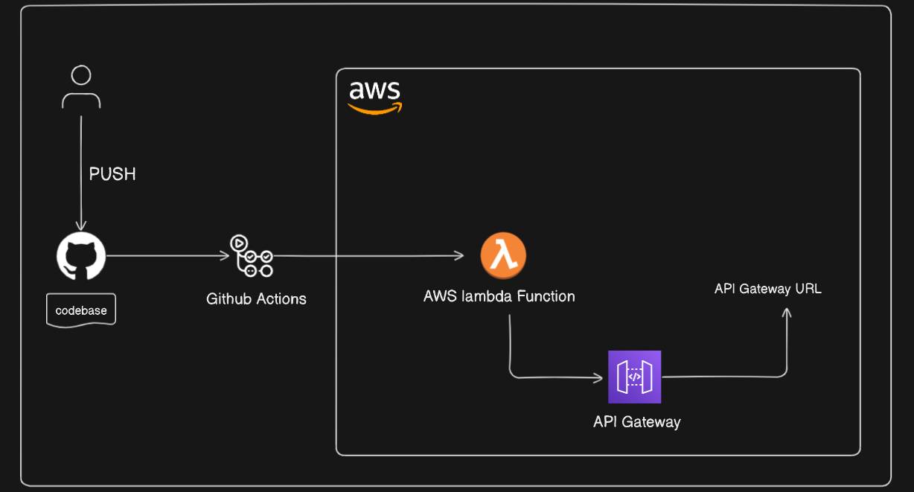

# Automating AWS Lambda Function Deployment Using GitHub Actions

## Introduction

In this tutorial, we aim to automate the deployment of an AWS Lambda function using GitHub Actions. AWS Lambda is a serverless compute service that runs your code in response to events and automatically manages the underlying compute resources. We need Lambda functions for building scalable, event-driven applications without having to manage the server infrastructure. By leveraging GitHub Actions, we can streamline our deployment process, ensuring that every change pushed to our repository is automatically deployed to AWS Lambda.



## Prerequisites

Before starting, ensure you have the following:

1. An AWS account with appropriate permissions to create and manage Lambda functions and API Gateway.
2. Node.js and npm installed locally.

## Steps to Achieve Our Goal

### Step 1: Create an AWS Lambda Function with Node.js

1. **Create a Lambda Function**:
   - Go to the AWS Management Console.
   - Navigate to AWS Lambda.
   - Click on "Create function".
   - Select "Author from scratch".
   - Enter the function name (e.g., `my-lambda-action`).
   - Choose Node.js as the runtime (e.g., Node.js 20.x).
   - Click on "Create function".

   

2. **Add an API Gateway Trigger**:
   - In the Lambda function page, click on "Add trigger".
   - Select "API Gateway".
   - Choose "Create an API".
   - Set the API type to "HTTP API".
   - Click on "Add".

   

   - Note the "API Gateway URL" for testing later.

   
   


3. **Test the Lambda Function**:
   - Add a simple handler code in the Lambda function console:
     ```javascript
     exports.handler = async (event) => {
       return {
         statusCode: 200,
         body: JSON.stringify('Hello from Lambda!'),
       };
     };
     ```
   - Click on "Deploy".
   - Test the endpoint by accessing the API Gateway URL in your browser.

   

### Step 2: Create a GitHub Repository and Add AWS Secrets

1. **Create a GitHub Repository**:
   - Go to GitHub and create a new repository (e.g., `lambda-gh-action`).

2. **Add AWS Secrets**:
   - Go to your repository settings.
   - Navigate to **Secrets and variables** > **Actions** > **New repository secret**.
   - Add `AWS_ACCESS_KEY_ID` and `AWS_SECRET_ACCESS_KEY` with your AWS credentials.

   

### Step 3: Local Project Setup

1. **Initialize the Project Directory**:
   ```bash
   mkdir lambda-gh-action
   cd lambda-gh-action
   ```

2. **Initialize a Node.js Project**:
   ```bash
   npm init -y
   ```

3. **Install Dependencies**:
   ```bash
   npm install lodash
   ```

4. **Create Project Files**:
   - **index.js**:
     ```javascript
     const _ = require('lodash');

     exports.handler = async (event) => {
       const maxValue = 100;
       const randomNumber = _.random(0, maxValue);
       const response = {
         statusCode: 200,
         body: JSON.stringify(`Random number: ${randomNumber}`),
       };
       return response;
     };
     ```
   - **.gitignore**:
     ```gitignore
     node_modules/
     lambda_function.zip
     ```
   - **package.json**:
     ```json
     {
       "name": "lambda-gh-action",
       "version": "1.0.0",
       "description": "",
       "main": "index.js",
       "scripts": {
         "test": "echo \"Error: no test specified\" && exit 1"
       },
       "dependencies": {
         "lodash": "^4.17.21"
       },
       "author": "",
       "license": "ISC"
     }
     ```

### Step 4: Create GitHub Actions Workflow

Create the `.github/workflows/deploy.yml` file with the following content:

```yaml
name: Deploy Lambda Function

on:
  push:
    branches:
      - main

jobs:
  deploy:
    runs-on: ubuntu-latest  # 1. Uses GitHub's hosted runner

    steps:
    - name: Checkout code
      uses: actions/checkout@v3  # 2. Checks out your repository code

    - name: Set up Node.js
      uses: actions/setup-node@v3
      with:
        node-version: '14'  # 3. Sets up the specified Node.js version

    - name: Install dependencies
      run: npm install  # 4. Installs Node.js dependencies

    - name: List installed packages
      run: ls node_modules  # 5. Lists the contents of the node_modules directory for debugging

    - name: Print npm version
      run: npm --version  # 6. Prints the npm version for debugging

    - name: Zip Lambda function
      run: zip -r lambda_function.zip .  # 7. Zips the entire project directory

    - name: Install AWS CLI
      run: |
        sudo apt-get update
        sudo apt-get install -y python3-pip
        pip3 install awscli  # 8. Installs the AWS CLI

    - name: Deploy to AWS Lambda
      env:
        AWS_ACCESS_KEY_ID: ${{ secrets.AWS_ACCESS_KEY_ID }}  # 9. Uses secrets for AWS access
        AWS_SECRET_ACCESS_KEY: ${{ secrets.AWS_SECRET_ACCESS_KEY }}
      run: |
        aws lambda update-function-code --function-name my-lambda-action --zip-file fileb://lambda_function.zip --region us-east-1  # 10. Deploys the Lambda function
```

1. **Checkout Code**:
   ```yaml
   - name: Checkout code
     uses: actions/checkout@v3
   ```
   This step uses the `actions/checkout@v3` action to check out the repository's code. This is necessary so that the workflow has access to the codebase to perform further actions on it.

2. **Set Up Node.js**:
   ```yaml
   - name: Set up Node.js
     uses: actions/setup-node@v3
     with:
       node-version: '14'
   ```
   This step uses the `actions/setup-node@v3` action to set up Node.js version 14 in the workflow environment. This ensures that the environment is prepared to run Node.js commands and scripts.

3. **Install Dependencies**:
   ```yaml
   - name: Install dependencies
     run: npm install
   ```
   This step runs the `npm install` command to install all Node.js dependencies listed in the `package.json` file. It ensures that all required packages are available for the project to run.

4. **Zip Lambda Function**:
   ```yaml
   - name: Zip Lambda function
     run: zip -r lambda_function.zip .
   ```
   This step creates a ZIP archive of the entire project directory. The resulting `lambda_function.zip` file contains all the necessary code and dependencies required to deploy the Lambda function.

5. **Deploy to AWS Lambda**:
   ```yaml
   - name: Deploy to AWS Lambda
     env:
       AWS_ACCESS_KEY_ID: ${{ secrets.AWS_ACCESS_KEY_ID }}
       AWS_SECRET_ACCESS_KEY: ${{ secrets.AWS_SECRET_ACCESS_KEY }}
     run: |
       aws lambda update-function-code --function-name my-lambda-action --zip-file fileb://lambda_function.zip --region us-east-1
   ```
   This step deploys the zipped Lambda function to AWS Lambda. It uses the AWS CLI command `aws lambda update-function-code` to update the code of the specified Lambda function (`my-lambda-action`) with the contents of the `lambda_function.zip` file. The AWS credentials (`AWS_ACCESS_KEY_ID` and `AWS_SECRET_ACCESS_KEY`) are securely accessed from GitHub Secrets.

### Step 5: Push to GitHub

1. **Initialize Git and Push Initial Commit**:
   ```bash
   git init
   git add .
   git commit -m "Initial commit"
   git remote add origin <your-github-repo-url>
   git push -u origin main
   ```

### Step 6: Verify in GitHub Actions

1. **Check GitHub Actions**:
   - Go to the **Actions** tab in your GitHub repository.
   - Ensure the workflow runs successfully. Check the logs for each step to verify that the steps were executed correctly.

   

### Step 7: Test the Output

1. **Test the API Endpoint**:
   - Access the API Gateway URL again to verify that the Lambda function is working as expected with the new deployment.

   

## Conclusion

By following this guide, you have set up a continuous deployment pipeline for your AWS Lambda function using GitHub Actions. This automation ensures that any changes pushed to the `main` branch are automatically deployed, simplifying the deployment process and ensuring that your Lambda function is always up-to-date.